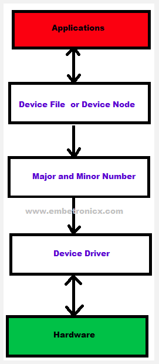
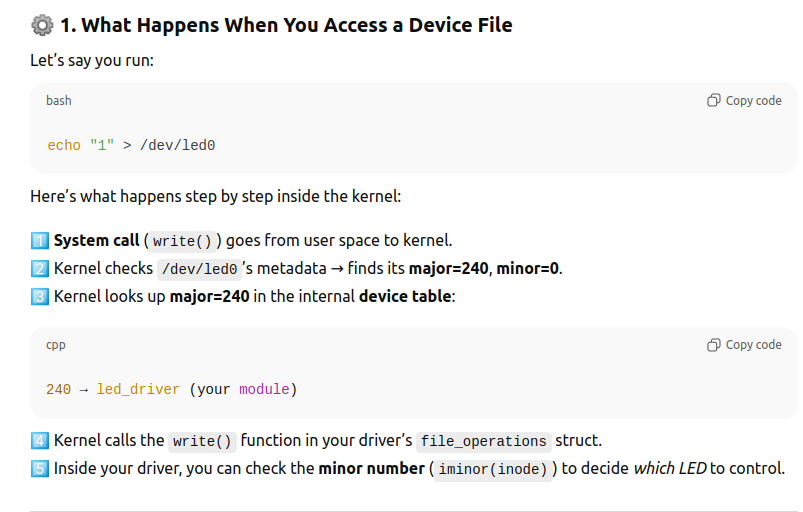
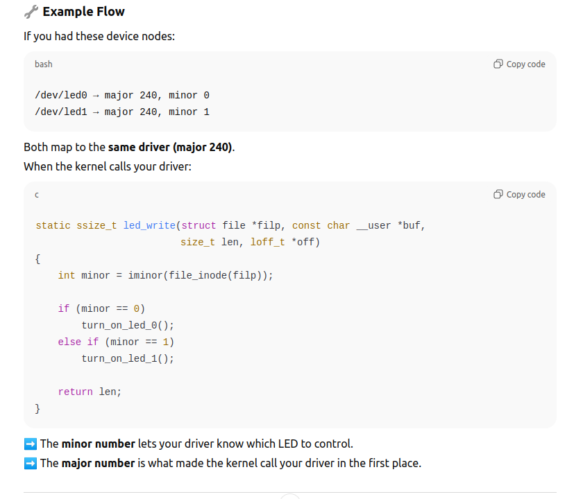

# 1) Main Types of Device Driver.
There are three main types of devices:
+ Character Device : Data is transferred byte-by-byte. No buffering by kernel. Example : serial port (/dev/ttyS0), GPIO, I2C, LEDs, Keyboards. Created via register_chrdev() or cdev_add() in kernel driver.

+ Block Device : Data is transferred block-by-block. The kernel caches and buffers data. Hard disk (/dev/sda), SD card, USB storage.

+ Network Device : Used to send/receive packets over network interfaces, not through /dev/. Example : Ethernet (eth0), Wifi (wlan0), Loopback

# 2) Major and Minor numbers
In Linux, devices (like GPIOs, serial ports, USBs, ...) are represented as special files in the /dev direcory. Example:
/dev/ttyS0
/dev/sda
/dev/led_driver

Each of these device files is associated with two numbers:
+ Major number : Identifies which driver (kernel module) handles the device

+ Minor number : Identifies specific device instance handled by that driver

Example: GPIO LED driver that can control 4 LEDs.

#define LED_MAJOR 240

| Device File | Major | Minor | Meaning |
| ----------- | ----- | ----- | ------- |
| `/dev/led0` | 240   | 0     | LED #0  |
| `/dev/led1` | 240   | 1     | LED #1  |
| `/dev/led2` | 240   | 2     | LED #2  |
| `/dev/led3` | 240   | 3     | LED #3  |

+ Initially, the Application will open the device file. This device file is created by the device driver).
+ Then this device file will find the corresponding  device driver using major and minor numbers.
+ Then that Device driver will talk to the Hardware device.

# Why the Kernel Needs Major Numbers
Linux supports thousands of devices — each with different drivers.
When you access /dev/sda, /dev/ttyS0, or /dev/gpiochip0, the kernel needs a fast way to find which driver is responsible.

# Why Minor Numbers Exist
Because a single driver can manage many physical devices — for example:
+ One serial driver → multiple serial ports (/dev/ttyS0, /dev/ttyS1)
+ One disk driver → multiple partitions (/dev/sda1, /dev/sda2)
+ One LED driver → multiple LEDs
+ Each instance is distinguished by its minor number.

